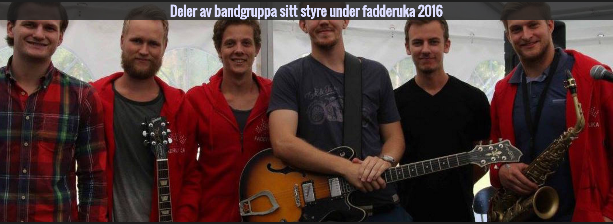

# HUGO-portfolio-tema
Et enkelt tema laget for HUGO


# Hva er HUGO?
Hugo er et framework for å lage statiske nettsider. Hugo lar deg enkelt lage blogginnlegg skrevet i Markdown og vil ut i fra innholdet lage en statisk side.
Dette er en trygg og enkel fremgangsmåte til å lage nettsider.

# Installer HUGO
HUGO er gratis og det er greit å følge [denne](https://gohugo.io/overview/installing/) guiden for å installere HUGO. Linken inneholder også alt du 
måtte lure på om hvordan man skal bruke eller utvikle HUGO-sider.

# Sett opp tema
Dette er utrolig enkelt og vil ta rundt 5-10 minutter.

## Start et HUGO prosjekt
I en terminal skriv `hugo new navnpåprosjekt`
HUGO lager nå et skjelett for nettsiden vår. Dette skjelettet inneholder en mappe som heter themes, det er hit vi skal legge temaet.

### Ved hjelp av GIT
`cd themes`  
`git clone https://github.com/klyngen/HUGO-portfolio-tema.git`

### Manuelt
last ned tema fra git i form av en ZIP-fil. Pakk ut innholdet i themes-mappen.

## Konfigurasjon

Her er mitt eksempel på en konfigurasjonsfil. Du vil se i rota på HUGO-siden din, at det er en fil som heter 
config.toml, denne må vi redigere.

```
languageCode = "nb-no"
title = "Martin Klingenberg"
author = "Martin Klingenberg"
baseurl = "http://folk.ntnu.no/martkli"
theme = "custom"

[params]
description = "Et protofølje for Martin Klingenberg, samt blogg og design"
keywords = "Blogg, NTNU, Martin Klingenberg, design, IT"
paral1 = "paral1.jpeg"
paral2 = "paral2.jpg"
card1 = "cpp.png"
card2 = "python.png"
card3 = "web2.png"
card4 = "tux.png"
selvportrett = "meg.jpg"
```  
Mye her er selvforklarende. Title blir til navnet som er øverst på siden. author, description og keywords
er mest for at siden skal bli mere attraktiv for søkemotorer. 

### paral1 og paral2
paral er en forkortelse for paralax. Det er bakgrunnsbildene som scroller med vinduet. Det er to av dem som må spesifiseres.



### card1, 2, 3, 4
Disse er kortene som befinner seg på siden. Disse bildene setter du også opp.


### Bildelokasjon
Alle bildene i konfigurasjonsfila må ligge i mappen med navn "static". Hvis ikke dukker de ikke opp på siden.

### Selvportrett
Dette er bildet øverst på forsiden

## Legge til innhold
Blogg og designsiden vil ikke dukke opp om du ikke har minimum ett innlegg. Du lager en mal for et innlegg ved å skrive  
`hugo new blogg/navn.md`
`hugo new design/navn.md`

dette vil lage en fil du kan redigere inne i content-mappen

Her er et eksempel på en slik fil  

```
+++
date = "2017-02-05T04:13:18+01:00"
title = "Whiteboard"
description = "Selvbygd whiteboard med lys"
featured_image = "feat.jpg"
+++
```  

Mellom plusstegnene finner du de viktigste attributtene du må konfigurere. Under plusstegnene kan du skrive vanlig 
github-markdown.

### Bildeplassering
Når det kommer til hvor bildene må plasseres for innlegg er dette litt vanskeligere. 
si at du har laget et blogginnlegg, og innlegg.md ligger i mappen `content/blogg/innlegg.md`. Bilder du legger 
til må ligge i `static/blogg/innlegg/`, for at HUGO skal finne de.

## Start HUGO
Du kan forhåndsvise siden din lokalt ved å skrive `hugo serve` i et terminalvindu. Du vil få en link der du kan forhåndsvise 
siden i nettleseren. Når du lagrer en fil, vil siden automatisk oppdateres. Ganske kult

## Kompiler siden din
Du skal laste opp nettsiden din til en server. Derfor må du lage de nødvendige filene. Skriv `hugo`  
nettsiden din ligger nå i public/


# Tilpass siden
Det er nok lurt å tilpasse themes/layouts/index.html. Lag gjerne en Fork av arbeidet mitt, og vis meg gode forbedringer.
Jeg er ikke noen mester på javascript.
